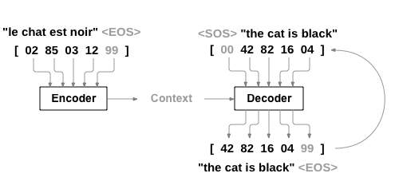
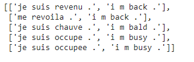
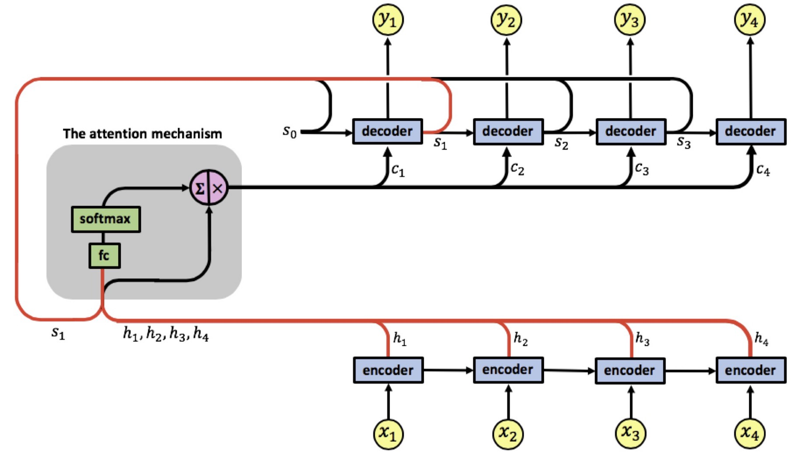
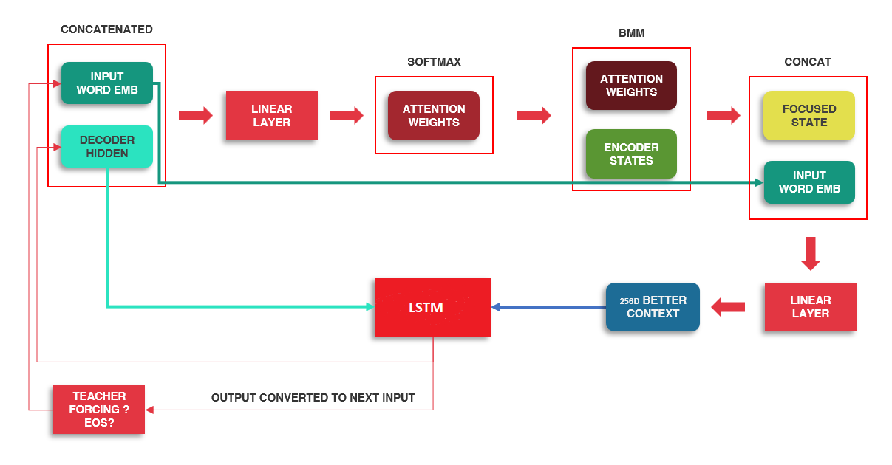
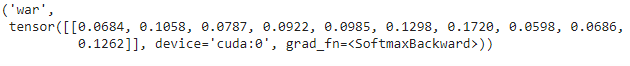
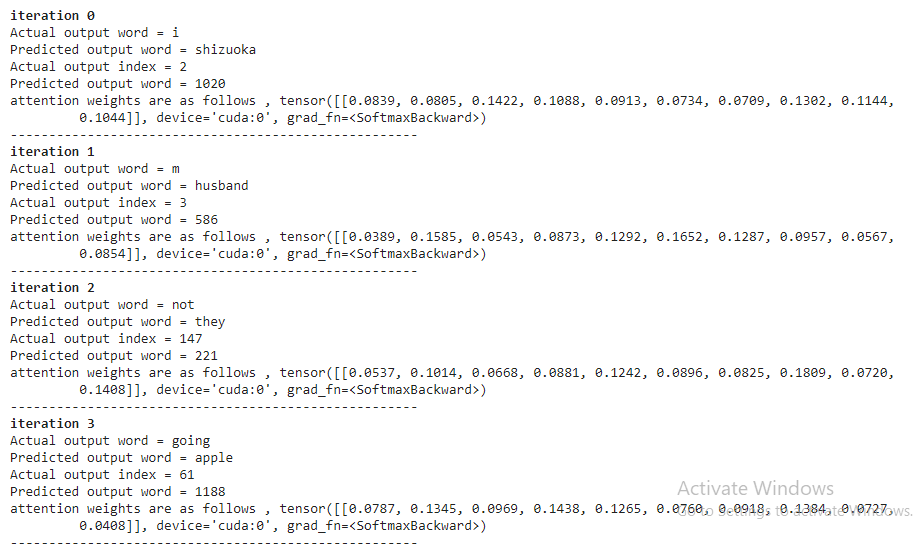

# NLP From Scratch: Translation With A Sequence To Sequence Network And Attention

### Introduction

In this notebook we implement one full feed forward step for the encoder and one for decoder **manually** with attention mechanism .

Here we will be teaching a neural network to translate from French to English.

```
[KEY: > input, = target, < output]

> il est en train de peindre un tableau .
= he is painting a picture .
< he is painting a picture .

> pourquoi ne pas essayer ce vin delicieux ?
= why not try that delicious wine ?
< why not try that delicious wine ?

> elle n est pas poete mais romanciere .
= she is not a poet but a novelist .
< she not not a poet but a novelist .

> vous etes trop maigre .
= you re too skinny .
< you re all alone .
```

This is made possible by the simple but powerful idea of the [sequence to sequence network](https://arxiv.org/abs/1409.3215), in which two recurrent neural networks work together to transform one sequence to another. An encoder network condenses an input sequence into a vector, and a decoder network unfolds that vector into a new sequence.



### Steps

#### **Data loading and preprocessing** 

We download French - English translation pair dataset from Pytorch official website [https://download.pytorch.org/tutorial/data.zip.](https://download.pytorch.org/tutorial/data.zip.)  Original dataset has 135842 sentence pairs. We trim dataset for easier training into 10599 sentence pairs . Final dataset has  4345 unique French words and  2803 unique English words. Sample data looks as follows :



#### Model architecture



As we can see here, we will have an encoder, an attention mechanism block and decoder. In the final code the attention mechanism block and decoder will be merged into single block as we need both to work together.

As we can see here, we need to create a copy of h1, h2, h3 and h4. These are encoder outputs for a sentence with 4 words.

#### Word Embedding

At the very first step, we should know what are the input-output sequences and how we should represent the data for the model to understand it. Clearly, it should be a sequence of words in the input and the equivalent sequence in the output. A learned representation for context elements is called `word embedding` in which the words with similar meaning, ideally, become highly correlated in the representation space as well. One of the main incentives behind word embedding representations is the high generalization power as opposed to sparse higher dimensional representation.

We will start from a sample sentence pair from our dataset.

```python
sample = random.choice(pairs)
sample
```

*sample = ['je ne vais pas jouer a ce jeu .', 'i m not going to play this game .']*

Before feeding into encoder embedding layer, we will tokenize input sentence, convert into indices , append EOS token and convert into tensors.

```python
input_sentence = sample[0]
output_sentence = sample[1]
input_indices = [input_lang.word2index[x] for x in input_sentence.split(' ')]
output_indices = [output_lang.word2index[x] for x in output_sentence.split(' ')]
input_indices.append(EOS_token)
output_indices.append(EOS_token)
input_tensor =torch.tensor(input_indices,dtype=torch.long ,device=device)
output_tensor = torch.tensor(output_indices,dtype=torch.long,device=device)
```

*input_tensor = (tensor([   6,  297,    7,  246, 2194,  115,  528, 2568,    5,    1],        device='cuda:0'),* 

*output_tensor =tensor([   2,    3,  147,   61,  532, 2070,  797, 1519,    4,    1],        device='cuda:0'))*

We are working with one sample, but we would be working for a batch. Let's fix that by converting our input_tensor into a fake batch.

```python
embedded_input = embedding(input_tensor[0].view(-1,1)) #first word only
embedded_input.shape
```

#### Encoder

Let's build our encoder now . The encoder of a seq2seq network is a LSTM that outputs some value for every word from the input sentence. 

The encoder generates a single output vector that embodies the input sequence meaning. The general procedure is as follows:

> 1. In each step, a word will be fed to a network and it generates an output and a hidden state.
> 2. For the next step, the hidden step and the next word will be fed to the same network (W) for updating the weights.
> 3. In the end, the last output will be the representative of the input sentence (called the "context vector").

First we will initialize  encoder hidden state and encoder cell state with zero tensor . All we need finally is the list of outputs. Let's create an empty tensor to store them as well. 

When we use encoder class from Pytorch it will internally handle for loop for us , but here as we are writing from scratch we need to define for loop explicitly to loop through multiple words in our input sentence .

```python

encoder_hidden,encoder_cell = torch.zeros((1,1,256),device=device), torch.zeros((1,1,256),device=device) # initialize encoder hidden and cell state with zero tensor
encoder_outputs = torch.zeros(MAX_LENGTH, 256, device=device)


for i in range(input_tensor.shape[0]) :
    embedded_input = embedding(input_tensor[i].view(-1, 1))
    output, (encoder_hidden,encoder_cell) = lstm(embedded_input, (encoder_hidden,encoder_cell))
    encoder_outputs[i] += output[0,0]

    print('\033[1m' +"Time step {}  \033[0m".format(i))
    if (i<input_tensor.shape[0]-1):
      print('Actual input word = {}'.format(input_sentence.split(" ")[i]))
    else:
      print('Actual input word = {}'.format("<EOS>"))
    print('Embedding of input word {} = {}'.format(i, output[0,0]))
    print('Encoder output at this time step = {}'.format(output[0,0]))

```

Next let's build out Decoder where we have attention in-built.

####   Attention Decoder

The decoder is another LSTM that takes the encoder output vector(s) and outputs a sequence of words to create the translation.

The general procedure is as follows :


> 1. First input to the decoder will be SOS_token, later inputs would be the words it predicted (unless we implement teacher forcing)
> 2. Decoder LSTM's hidden state will be initialized with the encoder's last hidden state
> 3. We will use decoder LSTM's hidden state and last prediction to generate attention weight using a FC layer.
> 4. This attention weight will be used to weigh the encoder_outputs using batch matric multiplication. This will give us a NEW view on how to look at encoder_states.
> 5. Attention applied encoder_states will then be concatenated with the current decoder  input, and then sent to  a linear layer and then to the decoder LSTM.
> 6. Decoder LSTM's output will be sent to a FC layer to predict one of the output_language words

Let's look at the attention mechanism in detail before diving into code.

##### More about attention we used 

If only the context vector is passed between the encoder and decoder, that single vector carries the burden of encoding the entire sentence. Attention allows the decoder network to “focus” on a different part of the encoder’s outputs for every step of the decoder’s own outputs.


There are many variants of Attention Mechanisms, there are 2 major types. 

[Bahdanau Attention](https://arxiv.org/abs/1409.0473)

[Luong Attention](https://arxiv.org/abs/1508.04025)

For generating the attention weights, we use the last input and the decoder_hidden vectors. We can show this process via this image below:



First we calculate a set of attention weights (`attn_weights` in code). These will be multiplied by the encoder output vectors (`encoder_outputs` in code) to create a weighted combination. The result (called `attn_applied` in the code) should contain information about that specific part of the input sequence, and thus help the decoder choose the right output words. Calculating the attention weights is done with another feed-forward layer `attn_weights_layer`, using the decoder’s input (`embedded` in code) and hidden state (`decoder_hidden` in code) as inputs . Because there are sentences of all sizes in the training data, to actually create and train this layer we have to choose a maximum sentence length (input length for encoder outputs) that it can apply to. Sentences of the maximum length will use all the attention weights, while shorter sentences will only use the first few.

Let's look at code now .

```python
embedding = nn.Embedding(output_size, 256).to(device)
attn_weight_layer = nn.Linear(256 * 2, 10).to(device)
input_layer_lstm = nn.Linear(256 * 2 , 256).to(device)
lstm = nn.LSTM(256,256).to(device)
output_word_layer = nn.Linear(256, output_lang.n_words).to(device)

decoder_input = torch.tensor([[SOS_token]],device = device) #First input to the decoder will be SOS_token
decoder_hidden,decoder_cell = encoder_hidden,encoder_cell
output_size = output_lang.n_words
embedded = embedding(decoder_input)
attn_weights = attn_weight_layer(torch.cat((embedded[0], decoder_hidden[0]), 1))
attn_weights = F.softmax(attn_weights, dim = 1)
attn_applied = torch.bmm(attn_weights.unsqueeze(0), encoder_outputs.unsqueeze(0))

input_to_lstm = input_layer_lstm(torch.cat((embedded[0], attn_applied[0]),dim = 1))
input_to_lstm = input_to_lstm.unsqueeze(0)
decoder_output,(decoder_hidden , decoder_cell) = lstm( input_to_lstm, (decoder_hidden , decoder_cell))
output = F.relu(decoder_output)
output = F.softmax(output_word_layer(output[0]), dim = 1)
top_value, top_id= output.data.topk(1)
output_lang.index2word[top_id.item()], attn_weights
```



After the first decoder step, for the following steps, the input is going to be the previous word prediction of the RNN. So the output generation will be upon the network sequence prediction. In case of using `teacher_forcing`, the input is going to be the actual targeted output word. It provides better guidance for the training but it is inconsistent with the evaluation stage as targeted outputs do not exists! Let's see how prediction happens for full teacher forcing .

```python
pred = []
pred_idx = []
for i in range(4):
  decoder_input = torch.tensor([[output_indices[i]]],device = device) 
  decoder_hidden,decoder_cell = encoder_hidden,encoder_cell
  output_size = output_lang.n_words
  embedded = embedding(decoder_input)
  attn_weights = attn_weight_layer(torch.cat((embedded[0], decoder_hidden[0]), 1))
  attn_weights = F.softmax(attn_weights, dim = 1)
  attn_applied = torch.bmm(attn_weights.unsqueeze(0), encoder_outputs.unsqueeze(0))

  input_to_lstm = input_layer_lstm(torch.cat((embedded[0], attn_applied[0]),dim = 1))
  input_to_lstm = input_to_lstm.unsqueeze(0)
  decoder_output,(decoder_hidden , decoder_cell) = lstm( input_to_lstm, (decoder_hidden , decoder_cell))
  output = F.relu(decoder_output)
  output = F.softmax(output_word_layer(output[0]), dim = 1)
  top_value, top_id= output.data.topk(1)
  output_lang.index2word[top_id.item()], attn_weights
  pred.append(output_lang.index2word[top_id.item()])
  pred_idx.append(top_id.item())
  print('\033[1m' +"iteration {}  \033[0m".format(i))
  print('Actual output word = {}'.format(output_sentence.split(" ")[i]))
  print('Predicted output word = {}'.format(output_lang.index2word[top_id.item()]))
  print('Actual output index = {}'.format(output_indices[i]))
  print('Predicted output word = {}'.format( top_id.item()))
  print("attention weights are as follows , {}".format(attn_weights))
  print("-----------------------------------------------------")
```



We are getting very poor results now as model has seen only one input sentence once.  


Refer to complete solution  [here](https://github.com/krishnarevi/Attention_model_from_scratch/blob/main/NLP%20From%20Scratch%20Translation%20With%20A%20Sequence%20To%20Sequence%20Network%20And%20Attention.ipynb)
